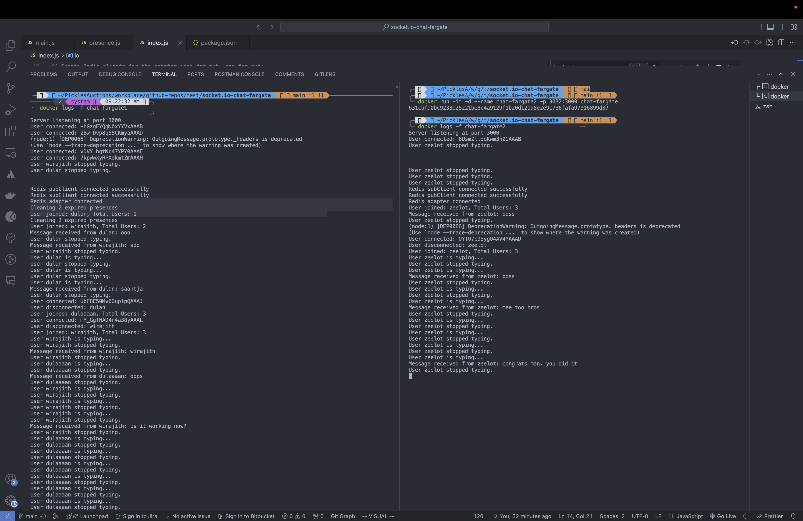
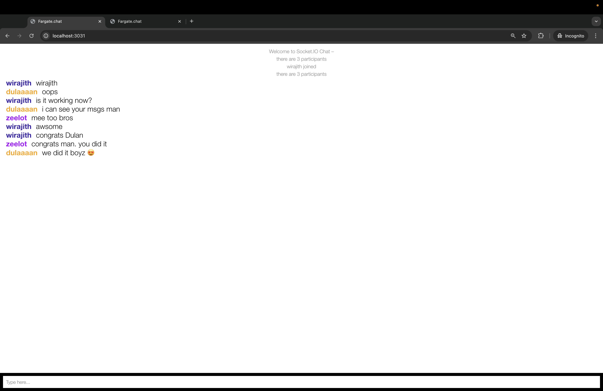
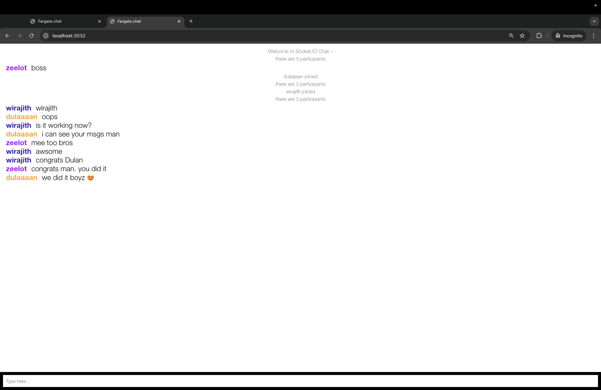
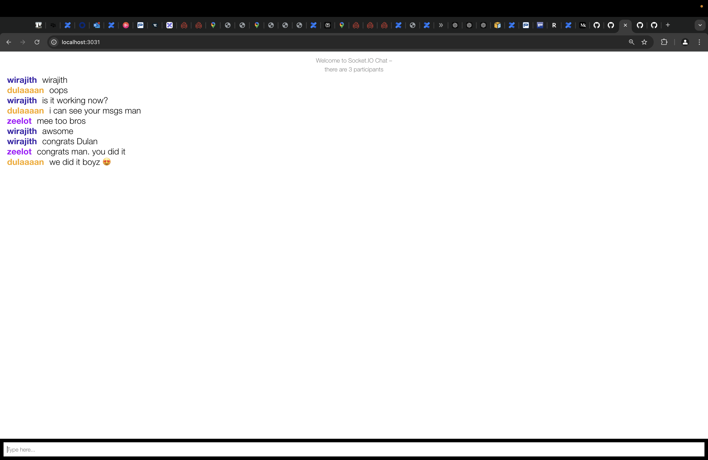

# Socket.IO Chat

A simple chat demo for socket.io

## How to use

```
$ npm install
$ npm start
```

And point your browser to `http://localhost:3000`. Optionally, specify
a port by supplying the `PORT` env variable.

## Screenshots 

### Server


### User 01


### User 02


### User 03

